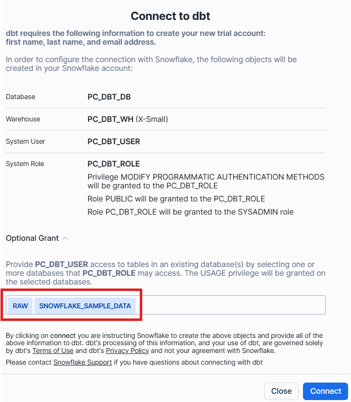
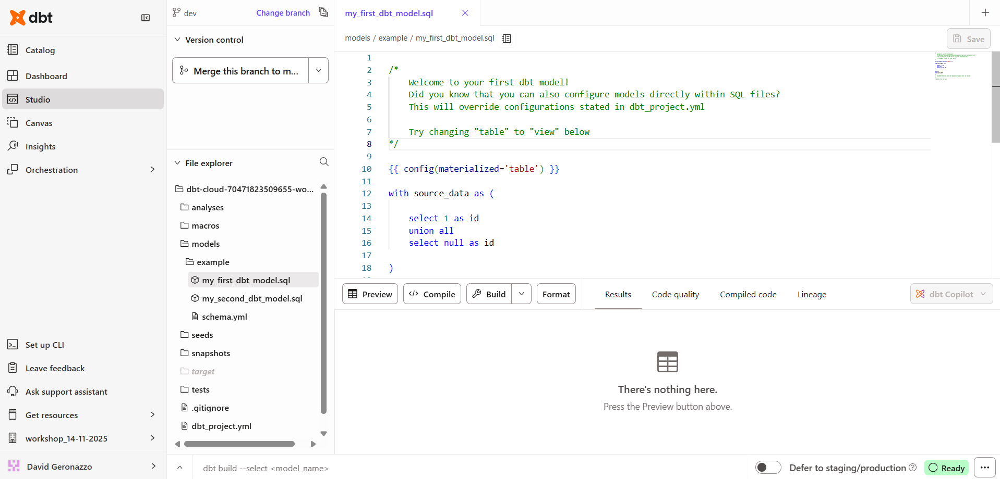

# Today's notebook
### Resources
- [List of dbt commands](https://docs.getdbt.com/category/list-of-commands)
- [dbt node selection syntax](https://docs.getdbt.com/reference/node-selection/syntax)
  
## Accounts & Setup
- [ ] Create a dbt trial account. (https://www.getdbt.com/signup)
- [ ] Create a Snowflake trial account (https://signup.snowflake.com/).
- [ ] Load data into snowflake

*New worksheet*:

```sql
-- initial setup
use role sysadmin;
create database dbt_db;
create database raw;
create schema raw.jaffle_shop;
create schema raw.stripe;
create warehouse transforming;

-- customer table --
create table raw.jaffle_shop.customers 
( id integer,
first_name varchar,
last_name varchar
);
-- load customer data
copy into raw.jaffle_shop.customers (id, first_name, last_name)
from 's3://dbt-tutorial-public/jaffle_shop_customers.csv'
file_format = (
    type = 'CSV'
    field_delimiter = ','
    skip_header = 1
    );

-- orders table --
create table raw.jaffle_shop.orders
( id integer,
user_id integer,
order_date date,
status varchar,
_etl_loaded_at timestamp default current_timestamp
);
-- load orders data --
copy into raw.jaffle_shop.orders (id, user_id, order_date, status)
from 's3://dbt-tutorial-public/jaffle_shop_orders.csv'
file_format = (
    type = 'CSV'
    field_delimiter = ','
    skip_header = 1
    );

-- payments table -- 
create table raw.stripe.payments
( id integer,
orderid integer,
paymentmethod varchar,
status varchar,
amount integer,
created date,
_batched_at timestamp default current_timestamp
);
-- load payments data -- 
copy into raw.stripe.payments (id, orderid, paymentmethod, status, amount, created)
from 's3://dbt-tutorial-public/stripe_payments.csv'
file_format = (
    type = 'CSV'
    field_delimiter = ','
    skip_header = 1
    );

-- checkout the tables
select * from raw.jaffle_shop.customers;
select * from raw.jaffle_shop.orders;
select * from raw.stripe.payments;  
```
--- 

- [ ] Connect Snowflake & dbt.
- Using **Partner Connect** (Recomended):
    
       
    

- **Manual connection**:
    ```sql
    use role accountadmin;
    create role dbt_transformer;
    set name = (select current_user());
    grant role dbt_transformer to user identifier($name);

    grant all on database raw to role dbt_transformer;
    grant all on database dbt_db to role dbt_transformer;

    grant all on schema raw.jaffle_shop to role dbt_transformer;
    grant all on schema raw.stripe to role dbt_transformer;

    grant all on all tables in database raw to role dbt_transformer;
    grant all on future tables in database raw to role dbt_transformer;
    ```

    Go to dbt *account settings*, create a **new project**, which require a *development environment* and so a *connection*.
    1. create a new project.
    2. setup a new connection: chose **Snowflake**\
        Enter: ACCOUNT - ROLE (leave black) - DATABASE `dbt_db` - WAREHOUSE `transforming`.
    3. setup the development environment:\
        Chose **Username and Password**;\
        Enter: USERNAME - PASSWORD - ROLE `dbt_transformer` - SCHEMA `dbt_<first-initial><last-name>`
    4. test connection and save.
    5. Setup a **managed** repository, and give it a name.

        
---

## Interface


## Models
**What are Models?**

Models are *select statement* (sql files): 
- modular steps of logics between our raw layer and the trnasformed layer.
- Each model maps to a table/view in the data platform.

Look at the `models/example` folder:
- 2 models (sql file)
- 1 schema (yml file)

-> We can `compile` the code and `preview` the data.

In order to refer to other models we use the **`ref`** macro: `select * from {{ref('my_model')}}` 

---
Let's create a new model.

- [ ] Create a new file inside: `models/customers.sql`
```sql
with customers as (
    select
        id as customer_id,
        first_name,
        last_name
    from raw.jaffle_shop.customers

),

orders as (
    select
        id as order_id,
        user_id as customer_id,
        order_date,
        status
    from raw.jaffle_shop.orders

),

customer_orders as (
    select
        customer_id,
        min(order_date) as first_order_date,
        max(order_date) as most_recent_order_date,
        count(order_id) as number_of_orders,
        sum(amount) as lifetime_value
    from orders
    group by 1

),

final as (
    select
        customers.customer_id,
        customers.first_name,
        customers.last_name,
        customer_orders.first_order_date,
        customer_orders.most_recent_order_date,
        coalesce(customer_orders.number_of_orders, 0) as number_of_orders,
        customer_orders.lifetime_value
    from customers
    left join customer_orders using (customer_id)
)

select * from final;
```
#### How to create a model in the data platform?
The `dbt run` command.
- create a spcific model: `dbt run --select customers`
- create all models inside a folder: `dbt run --select example`
- create all models: `dbt run`

- [ ] Create the *customers* model.
- [ ] Take a look in Snowflake.
  
## Materialization (view or table?)
dbt, by default, always creates models as views. But we can declare the materialization of a model in different ways:\
at a project level, or at model level. The model level overwrites the project level.\
Look at the examples models:
- config blocks in the models
- config in the `example/schema.yml` file
- project config in the `dbt_project.yml` file

- [ ] Materiliaze the *customers* model as a table.
  
## Lineage
Now, lets create our staging models (1-1 with our source tables):
- [ ] Create `stg_jaffle_shop__customers.sql`
    ```sql
    with source as (
        select
            id as customer_id,
            first_name,
            last_name
        from raw.jaffle_shop.customers
    )

    select * from final
    ```
- [ ] create `stg_jaffle_shop__orders.sql`
    ```sql
    with source as (
        select
            id as order_id,
            user_id as customer_id,
            order_date,
            status
        from raw.jaffle_shop.orders
    )

    select * from final
    ```
- [ ] Use the `ref` macro to refer these in the *customer* model

## Sources
In dbt we configure our sources using `.yml` files.\
[YML files](https://docs.getdbt.com/best-practices/how-we-style/5-how-we-style-our-yaml) are human readable configuration files used to structure and document the models/objects inside the project.

Let's configure our sources.
- [ ] Create a .yml file `models/sources.yml` and configure our sources.
    ```yml
    sources:
        - name: jaffle_shop
            database: raw  
            schema: jaffle_shop  
            tables:
            - name: orders
            - name: customers

        - name: stripe
            tables:
            - name: payments
    ```
    *N.B.: we can avoid to add schema/database*
In dbt, we refer to sources using the `source` macro: `{{ source('source_name', 'object_name') }}`.\
Lets implement this in the models.

- [ ] Create a staging model for payments source `models/stg_stripe__payments.sql`.\
    To save time we can use the *codegen* package:
    - go to https://hub.getdbt.com/ 
    - install `codegen` package
    - compile in a new file:
        ```
        {{ codegen.generate_base_model(
            source_name='stripe',
            table_name='payments',
            materialized='table'
        ) }}
        ```
- [ ] Rafactor `stg_jaffle_shop__orders` and `stg_jaffle_shop__customers` to use sources.

Look at the lineage now.

## Project structure
[How we structure our dbt projects](https://docs.getdbt.com/best-practices/how-we-structure/1-guide-overview). For example:
```
snowflake_workshop
├── README.md
├── analyses
├── seeds
│   └── employees.csv
├── dbt_project.yml
├── macros
│   └── cents_to_dollars.sql
├── models
│   ├── intermediate *(by area)*
│   │   └── finance
│   ├── marts *(by area)*
│   │   ├── finance
│   │   ├── marketing
│   │   └── etc.
│   ├── staging *(by source)*
│   │   ├── jaffle_shop
│   │   └── etc.
│   └── utilities
├── packages.yml
├── snapshots
└── tests
```
- [ ] Create the `staging`, `marts` and `intermediate` folders.
- [ ] Refactor the *customer model* into `marts/marketing/dim_customers.sql`
- [ ] Refactor the staging models we created into the staging folder
- [ ] Configure to materialize the *marts models* as tables and the *staging models* as views.
```yml
models:
    snowflake_workshop:
        staging: 
            +materialized: view
                
        marts:
            +materialized: table
```
- [ ] Create a `fct_orders.sql` into `marts/finance` folder.
```sql
with orders as  (
    select * from {{ ref ('stg_jaffle_shop__orders' )}}
),

payments as (
    select * from {{ ref ('stg_stripe__payments') }}
),

order_payments as (
    select
        order_id,
        sum (case when status = 'success' then amount end) as amount

    from payments
    group by 1
),

 final as (

    select
        orders.order_id,
        orders.customer_id,
        orders.order_date,
        coalesce (order_payments.amount, 0) as amount

    from orders
    left join order_payments using (order_id)
)

select * from final
```
- [ ] *dim_customer* model should refer to this now.


## Source Freshness
- Freshness thresholds can be set in the YML file where sources are configured.\
  For each table, the keys `loaded_at_field` and freshness must be configured.

- A threshold can be configured for giving a warning and an error with the keys `warn_after` and `error_after`.
- The freshness of sources can then be determined with the command `dbt source freshness`.\
    *difference between the current time and the last timestamp*

- [ ] Configure source freshness
    ```yml
    config:
        freshness:
        warn_after:
            count: count
            period: period
        error_after:
            count: count
            period: period
    loaded_at_field: loaded_at_field
    ```
- [ ] Run `dbt source freshness`
- [ ] Look at the query log.

## Testing
Testing is used in software engineering to make sure that the code does what we expect it to.
* In Analytics Engineering, testing allows us to make sure that the SQL transformations we write produce a model that meets our assertions.
* In dbt, tests are written as select statements. These select statements are run against your materialized models to ensure they meet your assertions.

In dbt, there are two types of tests - generic tests and singular tests:
* These tests are predefined and can be applied to any column of your data models to check for common data issues. They are **written in YAML files**.
* Singular tests are data tests **defined by writing specific SQL queries that return records which fail the test conditions**:
    designed for a single purpose or specific scenario within the data models.

dbt ships with four built in tests: *unique, not null, accepted values, relationships*.

Tests can be run against your current project using a range of commands:
- `dbt test` runs all tests in the dbt project
- `dbt test --select test_type:generic`
- `dbt test --select test_type:singular`
- `dbt test --select one_specific_model`

- [ ] Create the yml file to define the tests. `models/staging/jaffle_shop/_stg_jaffle_shop.yml`
    ```yml
    models:
    - name: stg_jaffle_shop__customers
        columns:
        - name: customer_id
            tests:
            - unique
            - not_null
    - name: stg_jaffle_shop__orders
        columns:
        - name: order_id
            tests:
            - unique
            - not_null
        - name: status
            data_tests:
            - accepted_values:
                arguments:
                    values:
                    - completed
                    - shipped
                    - returned
                    - placed
                    - return_pending
        - name: customer_id
            data_tests:
            - relationships:
                arguments:
                    to: ref('stg_jaffle_shop__customers')
                    field: customer_id
    ```
- [ ] Create a singular test in `tests\assert_positive_value_for_total_amount.sql`
```sql
-- Refunds have a negative amount, so the total amount should always be >= 0.
-- Therefore return records where this isn't true to make the test fail.
select
    order_id,
    sum(amount) as total_amount
from {{ ref('stg_stripe__payment') }}
group by 1
having (total_amount < 0)
```
- [ ] test the models.
  

## Documentation
* Documentation is essential for an analytics team to work effectively and efficiently. 
* Strong documentation empowers users to self-service questions about data and enables new team members to on-board quickly.
>Documentation should be as automated as possible and happen as close as possible to the coding.

In dbt, models are built in SQL files. These models are documented in YML files that live in the same folder as the models.
* If a longer form, more styled version of text would provide a strong description, **doc blocks** can be used to render markdown in the generated documentation.

- [ ] Add documentation to the file `models/staging/jaffle_shop/_stg_jaffle_shop.yml`.
- [ ] Add a description for your `stg_jaffle_shop__customers` model and the column customer_id.
- [ ] Add a description for your `stg_jaffle_shop__orders` model and the column order_id.
- [ ] Create a reference to a doc block
- [ ] Create a doc block for your `stg_jaffle_shop__orders` model to document the status column.
Reference this doc block in the description of status in `stg_jaffle_shop__orders`.

Result: `models/staging/jaffle_shop/_stg_jaffle_shop.yml`
```yml
models:
  - name: stg_jaffle_shop__customers
    description: Staged customer data from our jaffle shop app.
    columns: 
      - name: customer_id
        description: The primary key for customers.
        data_tests:
          - unique
          - not_null

  - name: stg_jaffle_shop__orders
    description: Staged order data from our jaffle shop app.
    columns: 
      - name: order_id
        description: Primary key for orders.
        data_tests:
          - unique
          - not_null
      - name: status
        description: '{{ doc("order_status") }}'
        data_tests:
          - accepted_values:
              arguments:
                values:
                  - completed
                  - shipped
                  - returned
                  - placed
                  - return_pending
      - name: customer_id
        description: Foreign key to stg_customers.customer_id
        data_tests:
          - relationships:
              arguments:
                to: ref('stg_jaffle_shop__customers')
                field: customer_id
```

and `models/staging/jaffle_shop/_jaffle_shop.md`

```md

    
One of the following values: 

| status         | definition                                       |
|----------------|--------------------------------------------------|
| placed         | Order placed, not yet shipped                    |
| shipped        | Order has been shipped, not yet been delivered   |
| completed      | Order has been received by customers             |
| return pending | Customer indicated they want to return this item |
| returned       | Item has been returned                           |


```

## Deployemnt
* Running dbt comand on a schedule.
* dbt will use the *main* branch for deployment.
* models on a schedule
* Development in dbt is the process of building, refactoring, and organizing different files in your dbt project. This is done in a development environment using a development schema (dbt_jsmith) and typically on a non-default branch (i.e. feature/customers-model, fix/date-spine-issue). 
* After making the appropriate changes, the development branch is merged to main/master so that those changes can be used in deployment.
* Deployment in dbt (or running dbt in production) is the process of running dbt on a schedule in a deployment environment. The deployment environment will typically run from the default branch (i.e., main, master) and use a dedicated deployment schema (e.g., dbt_prod). The models built in deployment are then used to power dashboards, reporting, and other key business decision-making processes.
* The use of development environments and branches makes it possible to continue to build your dbt project without affecting the models, tests, and documentation that are running in production.


* A deployment environment can be configured in dbt on the Orchestration > Environments page.
* General Settings: You can configure which dbt version you want to use and you have the option to specify a branch other than the default branch.
* Data Warehouse Connection: You can set data warehouse specific configurations here. For example, you may choose to use a dedicated warehouse for your production runs in Snowflake.
* Deployment Credentials:Here is where you enter the credentials dbt will use to access your data warehouse:
IMPORTANT: When deploying a real dbt Project, you should set up a separate data warehouse account for this run. This should not be the same account that you personally use in development.
IMPORTANT: The schema used in production should be different from anyone's development schema.
Scheduling a job in dbt
Scheduling of future jobs can be configured in dbt on the Jobs page.
You can select the deployment environment that you created before or a different environment if needed.
Commands: A single job can run multiple dbt commands. For example, you can run dbt run and dbt test back to back on a schedule. You don't need to configure these as separate jobs.
Triggers: This section is where the schedule can be set for the particular job.
After a job has been created, you can manually start the job by selecting Run Now
Reviewing Jobs
The results of a particular job run can be reviewed as the job completes and over time.
The logs for each command can be reviewed.
If documentation was generated, this can be viewed.
If dbt source freshness was run, the results can also be viewed at the end of a job.
- setup a deployment environment.
- setup a *deployment* job that
  - run marts models at 30th minutes of every hour
  - test the models
  - check data fresheness.
  - updates the documentation

## dbt Catalog


## Extras
### pivot table with jinja
jinja intercat with variables/models before compile the sql code
Syntax:
- `` operation inside Jinja context
- `{{ x }}` we are pulling something out of the jinja context and printing it in the sql code
```

Se sono in montagna e sono

    {{ temperature }} gradi mi piace mangiare il gelato

    {{ temperature }} gradi mi piace mangiare uno strudel caldo

    {{ temperature }} gradi mi piace mangare un panino

```
aggiunta dash per sottrarre la linea di codice `-`
```

Se sono in montagna e sono

    {{ temperature }} gradi mi piace mangiare il gelato

    {{ temperature }} gradi mi piace mangiare uno strudel caldo

    {{ temperature }} gradi mi piace mangare un panino

```

```
-- 1.
{% set frase = 'mi piace mangiare molto la pizza'}
{{ frase }}

-- 2.

{{ animals[0] }}


{{ animals[0] }}


    select {{ j }} as number union all



    select {{ j }} as number  union all 




    select {{ j }} as number  union all 


```


