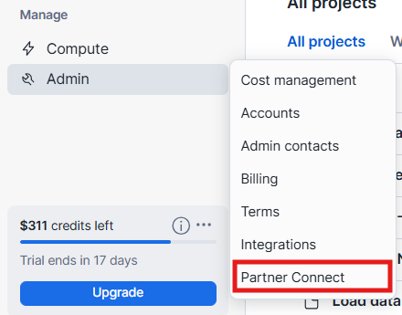
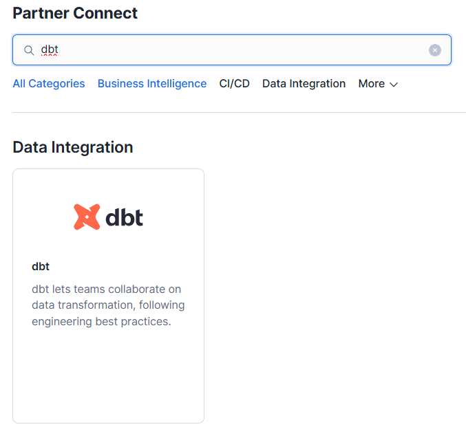
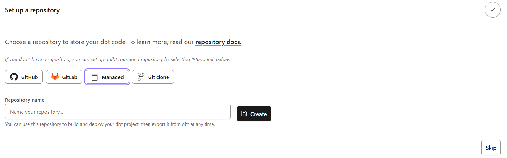

# Today's notebook
## Accounts & Setup
   1. - [ ] Create a dbt account. (link)
   1. - [ ] Create a Snowflake trial account (link).
   2. - [ ] Load data into snowflake
- *New worksheet*:

    ```sql
    -- initial setup
    use role sysadmin;
    create database dbt_db;
    create database raw;
    create schema raw.jaffle_shop;
    create schema raw.stripe;
    create warehouse transforming;

    -- customer table --
    create table raw.jaffle_shop.customers 
    ( id integer,
    first_name varchar,
    last_name varchar
    );
    -- load customer data
    copy into raw.jaffle_shop.customers (id, first_name, last_name)
    from 's3://dbt-tutorial-public/jaffle_shop_customers.csv'
    file_format = (
        type = 'CSV'
        field_delimiter = ','
        skip_header = 1
        );

    -- orders table --
    create table raw.jaffle_shop.orders
    ( id integer,
    user_id integer,
    order_date date,
    status varchar,
    _etl_loaded_at timestamp default current_timestamp
    );
    -- load orders data --
    copy into raw.jaffle_shop.orders (id, user_id, order_date, status)
    from 's3://dbt-tutorial-public/jaffle_shop_orders.csv'
    file_format = (
        type = 'CSV'
        field_delimiter = ','
        skip_header = 1
        );

    -- payments table -- 
    create table raw.stripe.payment 
    ( id integer,
    orderid integer,
    paymentmethod varchar,
    status varchar,
    amount integer,
    created date,
    _batched_at timestamp default current_timestamp
    );
    -- load payments data
    copy into raw.stripe.payment (id, orderid, paymentmethod, status, amount, created)
    from 's3://dbt-tutorial-public/stripe_payments.csv'
    file_format = (
        type = 'CSV'
        field_delimiter = ','
        skip_header = 1
        );
    
    select * from raw.jaffle_shop.customers;
    select * from raw.jaffle_shop.orders;
    select * from raw.stripe.payment;  
    ```
--- 

   
   1. - [ ] Connect Snowflake & dbt.
   - Using **Partner Connect**:
    
           
    

- **Manual connection**:

    Recomended:

    ```sql
    use role accountadmin;
    create role dbt_transformer;

    grant all on database raw to role dbt_transformer;
    grant all on database dbt_db to role dbt_transformer;

    grant all on schema raw.jaffle_shop to role dbt_transformer;
    grant all on schema raw.stripe to role dbt_transformer;

    grant all on all tables in database raw to role dbt_transformer;
    grant all on future tables in database raw to role dbt_transformer;
    ```

    dbt account settings, setup new project, which require a developmente envrionment and so a new connection.
    1. create a new project
    2. setup a new connection: chose **Snowflake**\
        Enter: ACCOUNT - ROLE (leave black) - DATABASE `dbt_db` - WAREHOUSE `transforming`.
    3. setup the development environment:\
        Chose **Username and Password**; Enter: USERNAME - PASSWORD - ROLE `dbt_transformer` - SCHEMA `dbt_<first-initial><last-name>`
    4. test connection and save.
    5. Setup a **managed** repository, and give it a name.

        
---
## Interface
